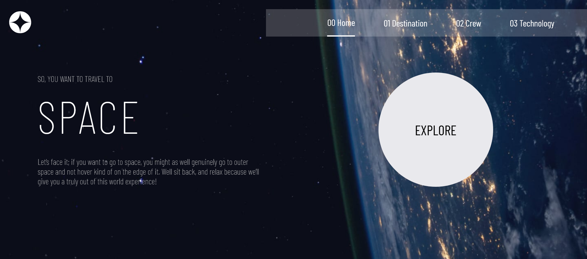

# Frontend Mentor - Space tourism website solution

This is a solution to the [Space tourism website challenge on Frontend Mentor](https://www.frontendmentor.io/challenges/space-tourism-multipage-website-gRWj1URZ3).

## Table of contents

- [Overview](#overview)
  - [The challenge](#the-challenge)
  - [Screenshot](#screenshot)
  - [Links](#links)
- [My process](#my-process)
  - [Built with](#built-with)
  - [What I learned](#what-i-learned)
  - [Continued development](#continued-development)
  - [Useful resources](#useful-resources)
- [Author](#author)
- [Acknowledgments](#acknowledgments)

## Overview

### The challenge

Users should be able to:

- View the optimal layout for each of the website's pages depending on their device's screen size
- See hover states for all interactive elements on the page
- View each page and be able to toggle between the tabs to see new information

### Screenshot



### Links

- Solution URL: [Click here](https://www.frontendmentor.io/solutions/responsive-single-page-application-q_lTUkY02X)
- Live Site URL: [Click here](https://space-tourism-single-page.herokuapp.com/)

## My process

### Built with

- Semantic HTML5 markup
- CSS custom properties
- JavaScript

### What I learned

When developing this Space tourism multi page website project, these new things I have learned.

-How to build a route function to make a singale page application.

```js
the route function in frontend/static/js/route
```
----

### Continued development


### Useful resources

- [Stackoverflow](https://stackoverflow.com/) - This helped me for many issues I have faced during the development of the project.
- [W3Schools](https://www.w3schools.com/) - Same as **Stackoverflow** , this helped me to understand some fundamental things about CSS and JS.

## Author

- Frontend Mentor - [@Abdulelah-Abacar](https://www.frontendmentor.io/profile/Abdulelah-Abacar)
- Github - [@Abdulelah-Abacar](https://github.com/Abdulelah-Abacar)

## Acknowledgments

I want to give thanks specially to [dcode](https://www.youtube.com/c/dcode-software) YouTube channel for helping me to get some inspiration to develop the route function.
